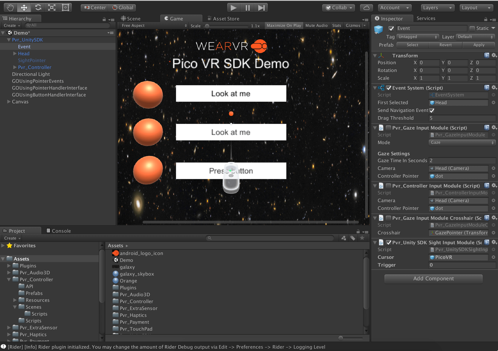

# Pico Unity VR SDK example project

This example project demonstrates how to integrate with the VR SDK and respond to input signals from the headset and Hummingbird controller shipped with the headset.

## Installation

Clone this repository to your hard drive

```
git clone
```

Open this folder in Unity as a new project.

Once in Unity, open the `Assets\Demo` scene.



## Overview

The project contains the following implementations:

##### GameObjects

* **GOUsingPointerEvents:** How to use pointer events to make GameObjects respond to headset or controller inputs
* **GOUsingPointerHandlerInterface:** How to use the [Pointer*Handler](https://docs.unity3d.com/ScriptReference/EventSystems.IPointerClickHandler.html) interfaces to make GameObjects respond to headset or controller inputs
* **GOUsingButtonHandlerInterface:** How to make GameObjects respond to non-pointer button and controller inputs

##### UGUI objects

* **UGUIUsingPointerEvents:** How to use pointer events to make `UGUI` objects respond to headset and controller inputs
* **UGUIUsingPointerHandlerInterface:** How to use [Pointer*Handler, ScrollHandler, *DragHandler](https://docs.unity3d.com/ScriptReference/EventSystems.IPointerClickHandler.html) and `IOnHoverHandler` interfaces to make `UGUI` objects respond to headset and controller inputs
* **UGUIUsingButtonHandlerInterface:** How to make `UGUI` objects respond to to non-pointer button and controller inputs

##### Event system

An event system with all the possible input modules attached, for quickly demoing them all (only one should be enabled at a time).

To run the example project, download the zip below, extract it and open it with a compatible version of Unity.
